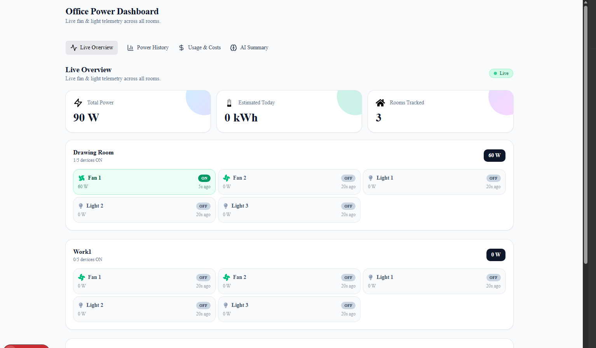
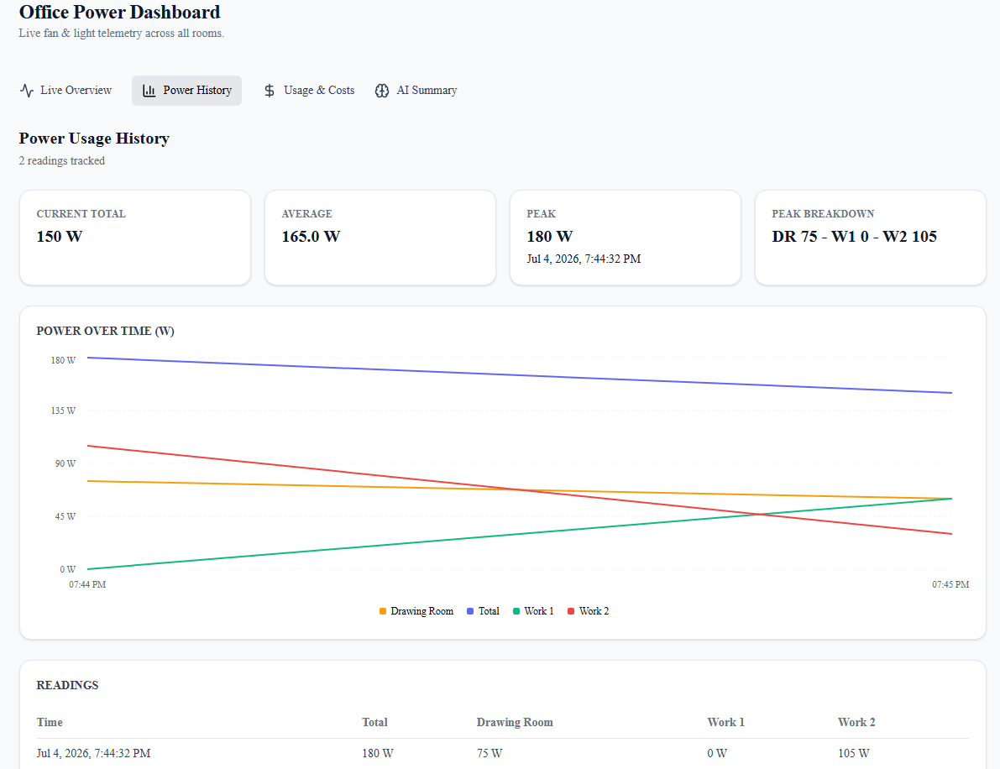
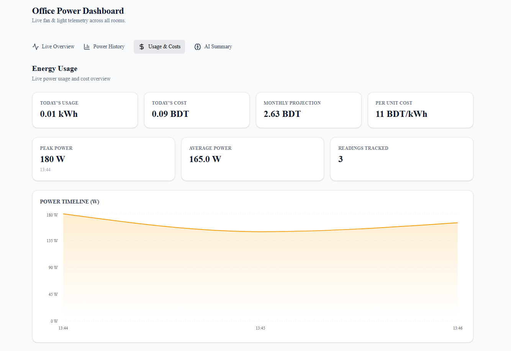
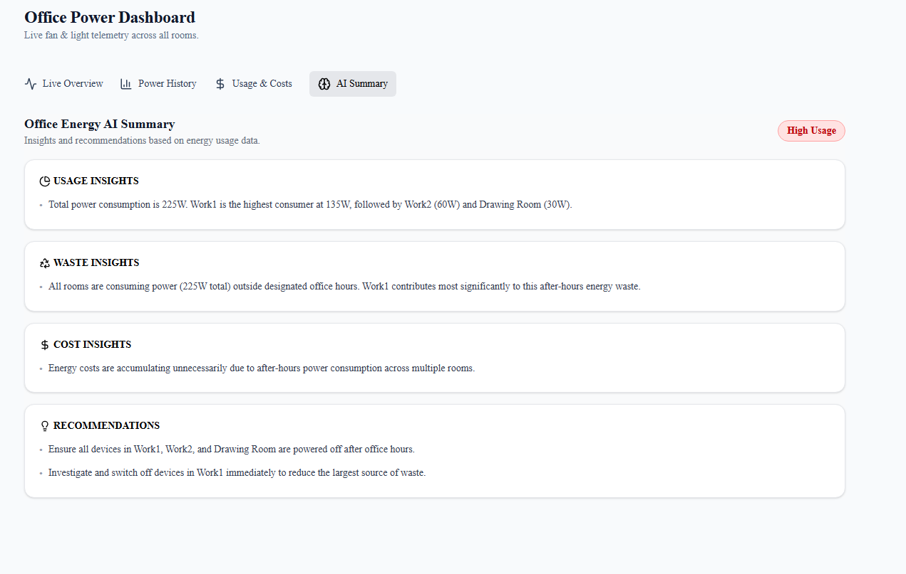

# Office Monitor — Energy Monitoring System

> Built by **Team Worst Generation** for the **IUT Robotics Society Hackathon**.

A real-time office energy monitoring system that tracks lights and fans, detects wasteful usage, estimates electricity costs, and delivers AI-powered insights — accessible from a web dashboard and a Discord bot.

---

## Table of Contents

1. [The Problem](#the-problem)
2. [Our Solution](#our-solution)
3. [Architecture](#architecture)
4. [Tech Stack](#tech-stack)
5. [Project Structure](#project-structure)
6. [Features](#features)
7. [Environment Setup](#environment-setup)
8. [Running the Project](#running-the-project)
9. [API Reference](#api-reference)
10. [Discord Bot Commands](#discord-bot-commands)
11. [Limitations](#limitations)
12. [Team](#team)

---

## The Problem

In many offices, lights and fans are left running even after working hours. No one notices this in real time, but the small oversight gradually leads to:

- **Unnecessary electricity consumption**
- **Higher electricity bills**
- **Reduced energy efficiency**

Without proper monitoring, it is difficult to identify where energy is being wasted or to take timely action.

---

## Our Solution

Office Monitor provides a **live, room-by-room view** of which devices are on, how much power they are drawing, and whether anything abnormal is happening (after-hours usage, devices left ON for too long, etc.). It turns raw device state into actionable information through:

- A **live web dashboard** showing real-time power, device status, and alerts.
- A **Discord bot** that exposes the same data through slash commands — no need to open the dashboard.
- **AI-powered insights** (Google Gemini) that summarise usage, detect waste, estimate cost, and recommend improvements.
- **Historical charts** for power usage trends and energy/cost breakdowns.

Because real IoT hardware was unavailable during development, a **simulation layer** mimics an office: devices toggle ON/OFF, office-hours bias is applied, and power is computed from fixed wattages (fans 60 W, lights 15 W).

---

## Architecture

```
┌─────────────────────────┐      REST + WebSocket      ┌─────────────────────┐
│  Frontend (Next.js)     │ ◄────────────────────────► │  Backend (FastAPI)  │
│  Dashboard + Charts     │                            │  Simulator + APIs   │
└─────────────────────────┘                            │  + Gemini Insights  │
                                                       └──────────┬──────────┘
                                                                  │ REST
                                                                  ▼
                                                       ┌─────────────────────┐
                                                       │  Discord Bot        │
                                                       │  Slash commands     │
                                                       └─────────────────────┘
```

- **Simulation Engine** — an asyncio loop runs every 5 seconds, randomly toggling devices with office-hours bias. Power is computed as `sum(active_devices.power_watt)`.
- **Backend (FastAPI)** — central processor. Holds device state, computes stats, raises alerts, serves REST + WebSocket, and calls Gemini for AI insights.
- **Frontend (Next.js 16)** — interactive dashboard (StatsBar, RoomPanel, DeviceCard, AlertsPanel, history charts). Receives live data via WebSocket and falls back to REST.
- **Discord Bot** — slash commands (`/status`, `/room`, `/usage`) that fetch from the backend and reply with rich embeds.
- **AI Insights (Gemini 2.5 Flash)** — receives current state, returns a structured `EnergyInsightModel` (usage / waste / cost insights + recommendations + overall status).

### Data flow

1. The simulator ticks every 5 s, updates device state, computes stats, generates alerts.
2. The backend broadcasts the new state to all WebSocket clients.
3. The frontend re-renders room panels, stats, and alerts instantly.
4. The AI Insights endpoint calls Gemini with the current state and returns structured recommendations.
5. The Discord bot periodically (or on demand) pulls from `/state` and posts embeds.

---

## Tech Stack

| Layer      | Technology                                                            |
| ---------- | --------------------------------------------------------------------- |
| Backend    | Python 3.10+, FastAPI, Uvicorn, Pydantic                              |
| Simulation | asyncio (in-process loop)                                             |
| AI         | Google Gemini (`gemini-2.5-flash`) via `google-genai`                 |
| Frontend   | Next.js 16, React 19, TypeScript, Tailwind CSS 4, Recharts, shadcn/ui |
| Bot        | discord.py 2.x, aiohttp                                               |
| Transport  | REST (HTTP) + WebSocket                                               |

---

## Project Structure

```
light-fan-project/
├── backend/                  # FastAPI service + simulation engine
│   ├── main.py               # App, simulator loop, REST + WS endpoints
│   ├── model/
│   │   └── ai_insight.py     # Pydantic schema for Gemini insights
│   ├── utils/
│   │   └── google_ai.py      # Gemini client wrapper
│   ├── requirements.txt
│   └── package.bat           # Windows helper: install / dev / run
│
├── bot/                      # Discord bot
│   ├── bot.py                # Slash commands: /status, /room, /usage
│   ├── requirements.txt
│   └── package.bat
│
├── frontend/                 # Next.js dashboard
│   ├── src/app/              # Pages: /, /history, /usage, /ai-insights
│   ├── src/components/       # StatsBar, RoomPanel, DeviceCard, etc.
│   ├── src/hooks/useSocket.ts
│   ├── src/lib/api_helper.ts # Typed REST client
│   └── package.json
│
└── README.md                 # You are here
```

---

## Features

### Live Dashboard

- **KPI bar** — total power (W), estimated kWh today, number of monitored rooms.
- **Room panels** — per-room list of every fan and light with status, wattage, and last-changed timestamp.
- **Alerts panel** — after-hours activity (≥ 3 devices still ON) and devices ON for 2+ hours.
- **Status pill** — WebSocket connection health.

### Power Usage History (`/history`)

- Interactive Recharts line chart of power readings over time.
- Current, average, and peak power consumption.
- Room-wise energy distribution.

### Energy Usage (`/usage`)

- Today’s energy consumption (kWh).
- Estimated electricity cost using **Bangladesh’s tariff**.
- Projected monthly bill.
- Peak and average power.

### AI Insights (`/ai-insights`)

- Google Gemini turns raw state into:
  - **Usage insights** — highest-consuming rooms/devices.
  - **Waste insights** — inefficiencies and idle devices.
  - **Cost insights** — daily cost, projections, room contribution.
  - **Overall status** — `Normal` / `High Usage` / `Critical`.
  - **Recommendations** — concrete actions to reduce waste.

### Discord Bot

- `/status` — total power + room breakdown.
- `/room <name>` — fan/light count and power for a specific room (`drawing_room`, `work1`, `work2`).
- `/usage` — current power and estimated daily kWh.

---

## Screenshots

## 📸 Live Overview

<p align="center">
  
</p>

---

## ⚡ Power Usage History

<p align="center">
  
</p>

---

## 💰 Usage & Costs

<p align="center">
  
</p>

---

## 🧠 AI Summary

<p align="center">
  
</p>

---

## Environment Setup

You will need **three** things running locally:

1. **Python 3.10+** (with pip, optionally Conda).
2. **Node.js 20+** and **npm** (for the Next.js frontend).
3. **A Discord bot token** and a **Google Gemini API key**.

### 1. Clone the repository

```bash
git clone https://github.com/maruf6890/office-electricity-tracker
cd Office-Monitor
```

### 2. Backend (Python)

#### Option A — Conda (recommended)

```bash
cd backend
conda create -n office-sim python=3.11 -y
conda activate office-sim
pip install -r requirements.txt
```

Or use the included helper:

```bat
cd backend
package.bat i
```

#### Option B — Plain venv

```bash
cd backend
python -m venv .venv
# Windows
.venv\Scripts\activate
# macOS / Linux
source .venv/bin/activate

pip install -r requirements.txt
```

Create a `.env` file inside `backend/` with your Gemini key:

```env
GOOGLE_API_KEY=your_gemini_api_key_here
```

### 3. Discord Bot (Python)

```bash
cd bot
python -m venv .venv
.venv\Scripts\activate        # Windows
source .venv/bin/activate     # macOS / Linux

pip install -r requirements.txt
```

Create a `.env` file inside `bot/` with your Discord token:

```env
DISCORD_TOKEN=your_discord_bot_token_here
```

> The bot is hard-coded to `GUILD_ID = 1171402384480677938` in `bot/bot.py`. Either change that constant to your own guild ID, or invite your bot to that guild for slash commands to sync.

### 4. Frontend (Node)

```bash
cd frontend
npm install
```

(Optional) create `frontend/.env.local` to point the API at a non-default host:

```env
NEXT_PUBLIC_API=http://localhost:8000
```

If unset, the frontend falls back to `http://localhost:8000`.

---

## Running the Project

Open **three terminals** and start each service in this order:

### Terminal 1 — Backend (FastAPI)

```bash
cd backend
conda activate office-sim          # if using Conda
uvicorn main:app --reload --host 0.0.0.0 --port 8000
```

Or with the helper:

```bat
cd backend
package.bat dev
```

You should see:

- FastAPI boot logs.
- After 5 seconds, the simulator begins broadcasting state.

Visit:

- REST: `http://localhost:8000/state`
- Docs: `http://localhost:8000/docs`
- WS: `ws://localhost:8000/ws`

### Terminal 2 — Discord Bot

```bash
cd bot
.venv\Scripts\activate             # Windows
python bot.py
```

The bot logs `Logged in as <name>` and `Slash commands synced`. You can now use `/status`, `/room`, and `/usage` in your Discord server.

### Terminal 3 — Frontend (Next.js)

```bash
cd frontend
npm run dev
```

Open `http://localhost:3000`.

The dashboard hydrates with REST and then switches to live WebSocket updates. You will see devices flip ON/OFF every ~5 seconds, KPIs move, and alerts appear when conditions trigger.

---

## API Reference

Base URL: `http://localhost:8000`

| Method | Endpoint       | Description                                                     |
| ------ | -------------- | --------------------------------------------------------------- |
| `GET`  | `/state`       | Full snapshot: devices, stats, recent alerts.                   |
| `GET`  | `/room/{room}` | Devices + power for a single room.                              |
| `GET`  | `/usage`       | Total power (W) and estimated kWh today.                        |
| `WS`   | `/ws`          | Live push of `{ devices, stats, alerts }` every simulator tick. |
| `GET`  | `/ai-insights` | Gemini-generated insights (if wired into `main.py`).            |

Example:

```bash
curl http://localhost:8000/state | jq
```

```json
{
  "devices": { "work1_fan_1": { "id": "work1_fan_1", "status": "on",  "power_watt": 60, ... }, ... },
  "stats":  { "total_power": 135, "room_power": { "drawing_room": 45, "work1": 60, "work2": 30 } },
  "alerts": [ { "type": "long_on", "message": "Fan 2 in work1 has been ON for 2+ hours", ... } ]
}
```

---

## Discord Bot Commands

| Command        | Description                                            |
| -------------- | ------------------------------------------------------ |
| `/status`      | Total power + per-room breakdown of fans, lights, W.   |
| `/room <name>` | Detailed view for `drawing_room`, `work1`, or `work2`. |
| `/usage`       | Current total power and estimated daily kWh.           |

Color cues on `/room`:

- 🟢 Green — power < 100 W
- 🟠 Orange — power < 200 W
- 🔴 Red — power ≥ 200 W

---

## Limitations

- **Simulated hardware.** There is no real IoT layer; devices toggle randomly with office-hours bias. Power ratings are fixed (fan 60 W, light 15 W) and do not reflect real-world fluctuations.
- **No persistence.** Device state, alerts, and history are kept in memory and reset when the backend restarts.
- **Discord bot is guild-scoped** to one ID. Update `GUILD_ID` in `bot/bot.py` to match your own server.
- **CORS is wide open** (`allow_origins=["*"]`) for development convenience — tighten before deploying.

---

## Team

**Team Worst Generation** — IUT Robotics Society Hackathon.

---

Built for the IUT Robotics Society Hackathon to demonstrate how IoT simulation, real-time monitoring, AI insights, and chat integrations can work together to reduce office energy waste.
